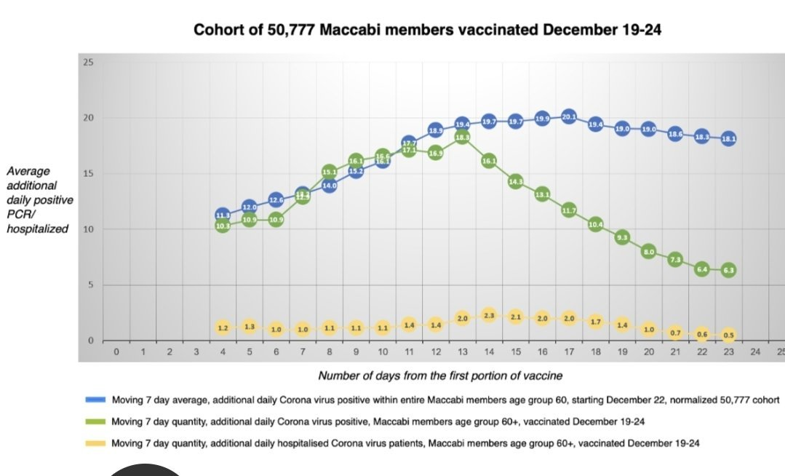
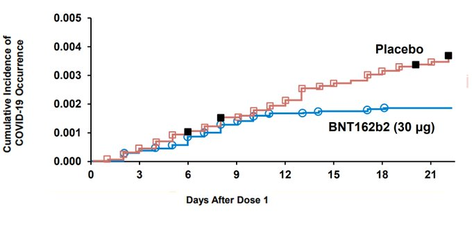

This exciting chart has emerged from the Maccabi study, providing evidence for efficacy of the Pfizer vaccine after the first dose.

As Eran Segal [pointed out on Twitter](https://twitter.com/segal_eran/status/1352696339377885187), the blue line actually includes the green line. I was interested to see what this would look like replotted as a Kaplan-Meier curve like the Pfizer graph.

<pre class='chroma'><code class='language-r' data-lang='r'>size_of_cohort = 50777
size_of_all_members = 480000
size_of_unvaccinated = size_of_all_members-size_of_cohort
data = data %&gt;% mutate(new_infections_all_members = AllMembersNormalised*size_of_all_members/size_of_cohort)
data = data %&gt;% mutate(new_infections_unvaccinated = new_infections_all_members - VaccinatedCohort)
data = data %&gt;% mutate(daily_incidence_unvaccinated = new_infections_unvaccinated/size_of_unvaccinated)
data = data %&gt;% mutate(daily_incidence_vaccinated = VaccinatedCohort/size_of_cohort)

graphdata = data %&gt;% select(<a href='https://rdrr.io/r/base/c.html'>c</a>(Day,contains("daily_incidence"))) %&gt;% pivot_longer(-Day,names_to="group",values_to="daily_incidence") %&gt;% separate(group,into=<a href='https://rdrr.io/r/base/c.html'>c</a>("bla","bla2","condition"),sep="_") %&gt;% select(-contains("bla")) %&gt;% group_by(condition) %&gt;% arrange(Day) %&gt;% mutate(cumulative_incidence=<a href='https://rdrr.io/r/base/cumsum.html'>cumsum</a>(daily_incidence))

graphdata$condition = <a href='https://rdrr.io/r/base/ifelse.html'>ifelse</a>(graphdata$condition=="unvaccinated","Control cohort",graphdata$condition)
ggplot(graphdata,aes(x=Day,y=cumulative_incidence,color=condition))+geom_line()+theme_classic()+labs(caption="Caveats: based on 7-day-moving average data so sharpness of start of initial efficacy will be understated. \n Blue line may contain vaccinated people",color="Condition",y="Cumulative Incidence")+scale_color_manual(values=<a href='https://rdrr.io/r/base/c.html'>c</a>("red","blue"))+geom_point()

</code></pre>

There are a lot of caveats about whether this is comparing like-for-like in terms of endpoint. In some respects it is definitely not, and everything is smoothed out by the 7 day moving average. In addition, this is a much older age group where we'd very much expect the immune response to take longer. Another really important [caveat](https://twitter.com/gbpolitics/status/1352764070668201985) is that the blue line likely includes people who were vaccinated later on.

In general the top plot presented by Maccabi is much more useful for getting a sense of what is going on (what direction the lines are pointing at the end of the Kaplain-Meier plot).

