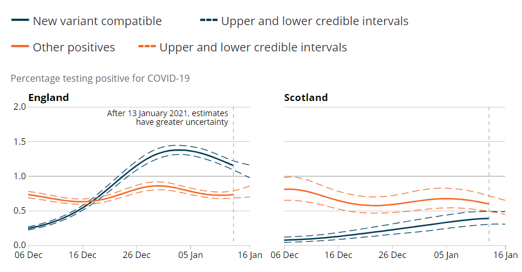
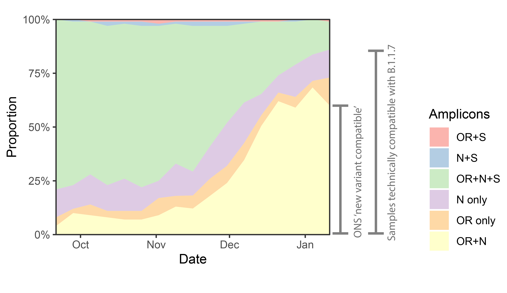

<small>Code behind this analysis: <a href="https://github.com/theosanderson/theo.io/tree/master/content/post/2021-01-22-ons-data" class="uri">https://github.com/theosanderson/theo.io/tree/master/content/post/2021-01-22-ons-data</a></small>

The ONS infection survey has come out and there has been a lot of discussion on the apparent decrease in proportion of "new variant compatible" cases.

To try to understand these patterns we need to go into a bit more detail. How are "new variant compatible" cases defined?

The TaqPath tests that produce this data amplify parts of three genes in the SARS-CoV2 genome:

-   The N gene
-   ORF1ab
-   The S gene

We know that B.1.1.7 often gives complete loss of the S-gene amplicon (data from Portugal suggest it doesn't [always](https://virological.org/t/tracking-sars-cov-2-voc-202012-01-lineage-b-1-1-7-dissemination-in-portugal-insights-from-nationwide-rt-pcr-spike-gene-drop-out-data/600)).

When B.1.1.7 was emerging the ONS defined a fairly conservative definition of "new variant compatible" tests. They said that these must be positive for N, *and* ORF1AB, but not for S. That is what we would expect to see for B.1.1.7 when there a lot of virions in the sample. But if a sample has a low number of virions, one or other of these genes might randomly drop below the detection threshold. Fortunately the ONS also report the data split out by each of the possible amplicon combinations, so we can examine this.

First let's convince ourselves that, irrespective of B.1.1.7, dropouts of amplicons can occur for various reasons. Let's look at the distribution of amplicons period of time in September, before B.1.1.7 had really emerged.

<pre class='chroma'><code class='language-r' data-lang='r'>subset = data %&gt;% <a href='https://rdrr.io/r/stats/filter.html'>filter</a>(week=="2020-09-21") %&gt;% <a href='https://rdrr.io/r/stats/filter.html'>filter</a>(RegionType=="EnglandRegion") %&gt;% mutate(AmpliconType = case_when(
 Amplicons %in% <a href='https://rdrr.io/r/base/c.html'>c</a>("N only","N+S","OR only","OR+S","S only") ~ "Random dropout",
  Amplicons == "OR+N+S" ~ "Definite non-B.1.1.7",
  Amplicons == "OR+N" ~ "Likely(?) B.1.1.7"
))
                                                                                                
                                                                                                
ggplot(subset,aes(x=AmpliconType,y=Count,fill=Amplicons))+geom_bar(stat="identity")+facet_wrap(~Region)+theme_bw()+ theme(axis.text.x = element_text(angle = 90, vjust = 0.5, hjust=1))

</code></pre>

I've separated out the `OR+N` amplicon types, which the ONS considers new variant compatible. Let's ignore these for now. We can see that there is a substantial variation in the other amplicon groups. If there were no random dropout (and no other variants that compromise an assay), we would expect everything else to be `OR+N+S`. But in the South West these make up a minority of the total positives identified. Instead it seems that some of these amplicons are randomly dropping out there.

We can also see a lot of geographical heterogeneity in the level of this random dropout. What drives this? We also have the mean Ct values for each region so we can test the hypothesis that high Ct values (low number of virions), due to a higher proportion of infections being identified longer after the original infection, are responsible for the "random dropout".

<pre class='chroma'><code class='language-r' data-lang='r'># Exclude suspected B.1.1.7 from the data
subset = data %&gt;% <a href='https://rdrr.io/r/stats/filter.html'>filter</a>(week=="2020-09-21") %&gt;% <a href='https://rdrr.io/r/stats/filter.html'>filter</a>(RegionType=="EnglandRegion") %&gt;% <a href='https://rdrr.io/r/stats/filter.html'>filter</a>(Amplicons!="OR+S")

#Calculate the proportion with "no random dropout", then invert to get proportion of "random dropout"
subset =subset %&gt;% group_by(Region) %&gt;% mutate(proportion = Count/<a href='https://rdrr.io/r/base/sum.html'>sum</a>(Count)) %&gt;% <a href='https://rdrr.io/r/stats/filter.html'>filter</a>(Amplicons=="OR+N+S") %&gt;% mutate(RandomDropout=1-proportion)

subset_cts = data_ct %&gt;% <a href='https://rdrr.io/r/stats/filter.html'>filter</a>(week=="2020-09-21") %&gt;% <a href='https://rdrr.io/r/stats/filter.html'>filter</a>(RegionType=="EnglandRegion")

both &lt;- inner_join(subset,subset_cts) 

#&gt; Joining, by = c("Region", "RegionType", "week")

ggplot(both,aes(x=Mean,y=RandomDropout,label=Region))+geom_point()+labs(x="Mean Ct value",y="Proportion of 'random dropout'")+<a href='https://rdrr.io/pkg/ggrepel/man/geom_text_repel.html'>geom_text_repel</a>()+theme_bw()+scale_y_continuous(labels=scales::<a href='https://scales.r-lib.org//reference/label_percent.html'>percent</a>)+labs("Relationship between Ct and levels of random dropout in September")

</code></pre>

Having convinced ourselves that random dropouts can occur at different levels due to differences in Ct values (and that Ct values [can differ due to epidemiological dynamics](https://www.medrxiv.org/content/10.1101/2020.10.08.20204222v1))), we can examine whether an increased rate of random dropouts in the N or ORF1ab genes (or both!) might cause an underestimation of B.1.1.7 prevalence when considering only `OR+N+S` as compatible with the new variant.

Now lets look at the trajectories of all amplicon groups over time in England.

<pre class='chroma'><code class='language-r' data-lang='r'>data = data %&gt;% group_by(Region,week) %&gt;% mutate(proportion = Count/<a href='https://rdrr.io/r/base/sum.html'>sum</a>(Count)) 

ggplot(data%&gt;% <a href='https://rdrr.io/r/stats/filter.html'>filter</a>(Region=="England"), aes(x=week,y=proportion,color=Amplicons))+geom_line()+theme_bw()+scale_y_continuous(labels=scales::<a href='https://scales.r-lib.org//reference/label_percent.html'>percent</a>)

</code></pre>

<pre class='chroma'><code class='language-r' data-lang='r'>

data$Amplicons = <a href='https://rdrr.io/r/base/factor.html'>factor</a>(<a href='https://rdrr.io/r/base/character.html'>as.character</a>(data$Amplicons),levels = <a href='https://rdrr.io/r/base/c.html'>c</a>("S only","OR+S","N+S","OR+N+S","N only","OR only","OR+N"))

p&lt;-ggplot(data%&gt;% <a href='https://rdrr.io/r/stats/filter.html'>filter</a>(Region=="England")%&gt;% <a href='https://rdrr.io/r/stats/filter.html'>filter</a>(Amplicons!="S only"), aes(x=week,y=proportion,fill=Amplicons))+geom_area()+theme_bw()+scale_y_continuous(expand=<a href='https://rdrr.io/r/base/c.html'>c</a>(0,0),labels=scales::<a href='https://scales.r-lib.org//reference/label_percent.html'>percent</a>)+scale_fill_brewer(type="qual",palette=4)+labs(x="Date",y="Proportion")+scale_x_date(expand=<a href='https://rdrr.io/r/base/c.html'>c</a>(0,0))

ggsave("plot.pdf",width=5,height=3)
</code></pre>

An annotated version of that plot: 

<pre class='chroma'><code class='language-r' data-lang='r'>ggplot(data%&gt;% <a href='https://rdrr.io/r/stats/filter.html'>filter</a>(RegionType=="EnglandRegion")%&gt;% <a href='https://rdrr.io/r/stats/filter.html'>filter</a>(Amplicons!="S only"), aes(x=week,y=proportion,fill=Amplicons))+geom_area()+theme_bw()+scale_y_continuous(expand=<a href='https://rdrr.io/r/base/c.html'>c</a>(0,0),labels=scales::<a href='https://scales.r-lib.org//reference/label_percent.html'>percent</a>)+scale_fill_brewer(type="qual",palette=4)+labs(x="Date",y="Proportion")+scale_x_date(expand=<a href='https://rdrr.io/r/base/c.html'>c</a>(0,0)) +facet_wrap(~Region)

</code></pre>

<pre class='chroma'><code class='language-r' data-lang='r'>
ggsave("plotregion.png",width=7*1.2,height=4*1.2)
</code></pre>

We can see a rise in `OR+N` over time. But this seems to tail off to at least horizontal at the end. Does this mean that B.1.1.7 is no longer increasing at the expense of other variants? Well I don't think we have evidence for this. `OR+N` may be horizontal, but `OR+N+S` seems likely to be decreasing faster. It is likely that this is due to a general change in the epidemic stage, as lockdown controls new infections and a higher proportion of old detections are detected.

Again if we want to look for an explanation we can investigate the Cts.

<pre class='chroma'><code class='language-r' data-lang='r'>ggplot(data_ct%&gt;% <a href='https://rdrr.io/r/stats/filter.html'>filter</a>(RegionType=="EnglandRegion"),aes(x=week, y=Mean))+geom_line() +labs(title="Regions")+facet_wrap(~Region)+theme_bw()+labs(y="Mean Ct value")

</code></pre>

In all regions we see an increase in mean Ct over January, which we'd expect to cause more random dropouts, and reduce the number of both WT viruses that appear as `OR+N+S` and of B.1.1.7 viruses that appear as `OR+N`.

One (imperfect) way to try to get a handle on this is to just plot the ratio of `OR+N+S` to `OR+N`, because both of these are affected by random drop out.

<pre class='chroma'><code class='language-r' data-lang='r'>ggplot(data%&gt;% <a href='https://rdrr.io/r/stats/filter.html'>filter</a>(Region=="England",Amplicons %in% <a href='https://rdrr.io/r/base/c.html'>c</a>("OR+N+S","OR+N")),aes(x=week, fill=Amplicons,y=Count))+geom_bar(stat="identity",position="fill")+scale_y_continuous(labels=scales::<a href='https://scales.r-lib.org//reference/label_percent.html'>percent</a>) +labs(title="England")

</code></pre>

<pre class='chroma'><code class='language-r' data-lang='r'>
ggplot(data%&gt;% <a href='https://rdrr.io/r/stats/filter.html'>filter</a>(RegionType=="EnglandRegion",Amplicons %in% <a href='https://rdrr.io/r/base/c.html'>c</a>("OR+N+S","OR+N")),aes(x=week, fill=Amplicons,y=Count))+geom_bar(stat="identity",position="fill")+scale_y_continuous(labels=scales::<a href='https://scales.r-lib.org//reference/label_percent.html'>percent</a>) +labs(title="Regions")+facet_wrap(~Region)

</code></pre>

Similarly we can also plot how the proportion of B.1.1.7 incompatible cases (those that do show S amplification) has changed.

<pre class='chroma'><code class='language-r' data-lang='r'>data = data %&gt;% mutate(B117_incompatible = <a href='https://rdrr.io/r/base/grep.html'>grepl</a>('S',Amplicons))

ggplot(data%&gt;% <a href='https://rdrr.io/r/stats/filter.html'>filter</a>(Region=="England",Amplicons %in% <a href='https://rdrr.io/r/base/c.html'>c</a>("OR+N+S","OR+N")),aes(x=week, fill=B117_incompatible,y=Count))+geom_bar(stat="identity",position="fill")+scale_y_continuous(labels=scales::<a href='https://scales.r-lib.org//reference/label_percent.html'>percent</a>) +labs(title="England")

</code></pre>

<pre class='chroma'><code class='language-r' data-lang='r'>
ggplot(data%&gt;% <a href='https://rdrr.io/r/stats/filter.html'>filter</a>(RegionType=="EnglandRegion",Amplicons %in% <a href='https://rdrr.io/r/base/c.html'>c</a>("OR+N+S","OR+N")),aes(x=week, fill=B117_incompatible,y=Count))+geom_bar(stat="identity",position="fill")+scale_y_continuous(labels=scales::<a href='https://scales.r-lib.org//reference/label_percent.html'>percent</a>) +labs(title="Regions")+facet_wrap(~Region)

</code></pre>

to be continued

